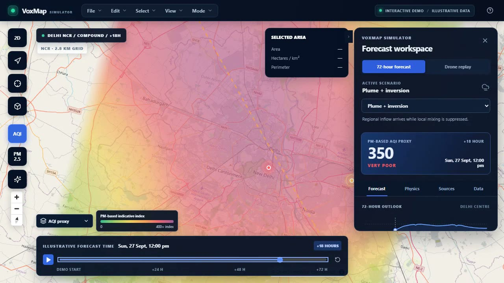
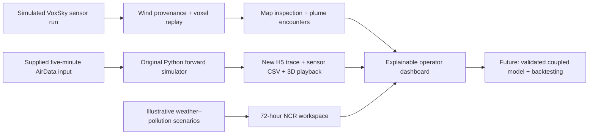

<div align="center">

# VoxMaps × SIH

### Explore how pollution moves. Explain what the sensors saw.

A map-first Delhi NCR air-quality **concept demo** with the supplied VoxMaps Python simulator integrated into the same React workspace. It connects an illustrative 72-hour scenario map, a simulated VoxSky drone replay, and a real local forward-simulation workflow.


[Watch the real UI walkthrough](brag-output/brag.mp4) · [Read the SIH alignment](SIH_ALIGNMENT.md) · [VoxMaps dashboard](https://voxmaps.in/dashboard)

<a href="brag-output/brag.mp4"></a>

*The video records the forecast/replay UI before the original Python simulator was integrated; it is not an animated mock-up.*

</div>

## The idea

The Ministry of Earth Sciences SIH challenge calls for a 72-hour Delhi NCR forecast that couples meteorology and air chemistry. VoxMaps adds a complementary field layer: GPS-tagged PM measurements, wind provenance, spatial reconstruction, and an operator view of how a plume may move. This repository is a **presentation-ready prototype of that workflow**, not a claim that the full forecasting science has been completed.



## What you can explore

| Workspace | Try it |
| --- | --- |
| **72-hour scenario map** | Scrub the timeline, compare typical dispersion, inversion, regional plume, and compound scenarios. Switch between AQI proxy, PM2.5, PM10, O₃, NOₓ, and inversion layers. |
| **Weather ↔ pollution explanation** | Toggle the illustrative aerosol-feedback loop and inspect the changes in PM, cooling, and boundary-layer height. |
| **2D and 3D views** | Inspect smoothed map colors or relative-height columns; click a cell to see the underlying scenario values. |
| **20-minute VoxSky replay** | Follow the supplied simulated drone track, sensor/reference PM readings, plume encounters, wind provenance, and voxel identifiers. |
| **Original simulator** | Load the bundled five-minute flight with one click; configure source, wind, solver, sensor and playback; run the supplied Python engine and inspect its generated H5/CSV and synchronized 3D playback. |
| **Five-minute particle trace** | Watch parcel motion from a *different* H5 simulation run and explore its voxel geometry. |
| **Operator tools** | Select four map corners, inspect locations, and export the illustrative forecast grid as CSV or GeoJSON. |

The interface follows the map-first language of the [VoxMaps dashboard](https://voxmaps.in/dashboard), with a responsive insight panel for smaller screens.

## Run locally

Requires Node.js/npm, Python 3.11+, and [uv](https://docs.astral.sh/uv/) for the original simulator. The dashboard alone can still run with Node.js only.

```bash
git clone https://github.com/aryan-stack-cloud/voxmaps-sih.git
cd voxmaps-sih
npm ci
uv sync --project simulator-engine --no-dev
```

Start the dashboard and simulator API together:

```bash
npm run dev:full
```

Open **http://127.0.0.1:5182/** and select **Original simulator**. The supplied React workflow now runs inside the dashboard rather than in an iframe; its requests go through the dashboard's `/api` proxy to the original Python engine at `127.0.0.1:8766`. You can still start `npm run simulator` and `npm run dev` in separate terminals if you prefer. In **Flight data**, click **Load demo flight** to run a new scenario, or **Open supplied H5 replay** to inspect the previously generated trace. The exact input and trace are documented in [`simulator-engine/demo-data/`](simulator-engine/demo-data/README.md). New run outputs go to the simulator's local `demo-runs` workspace, not into this Git repository. If a browser cannot initialize WebGL, the trace switches to a top-down parcel view while the timeline and audit remain usable. The basemap needs internet access; the Python simulator and bundled demo data run locally.

For checks, run `npm test`, `npm run build`, and from `simulator-engine/`, `python -m pytest` in an environment with the package's test dependencies. The original desktop UI source can be rebuilt with `corepack pnpm --dir simulator-engine/desktop install --frozen-lockfile` and `corepack pnpm --dir simulator-engine/desktop build`.

## A five-minute judge walkthrough

1. Start with **72-hour forecast**. Scrub to +36 and +72 hours, then compare *Strong inversion*, *Stubble plume*, and *Plume + inversion*.
2. Open **Physics** and toggle the illustrative two-way feedback. Change pollutant layers and briefly switch to 3D.
3. Open **Sources** to discuss *hypotheses*, not proven source attribution. Use the four-corner area selector to scope an inspection area.
4. Switch to **Drone replay → 20-min sensors**. Scrub to the plume encounter near the end of the flight and inspect PM and wind provenance.
5. Open **Original simulator** and click **Load demo flight**. Review the source, wind and numerical settings, then press **Run Simulation**. Show the eight real worker stages and the two generated files.
6. Open its synchronized **3D playback**. Alternatively, use **Open supplied H5 replay** for an immediate trace preview. This five-minute input/trace pair is separate from the 20-minute dashboard replay, whose flight sensor shows brief plume encounters.

## Data and scientific boundary

The integrated [`simulator-engine/`](simulator-engine/) is the supplied version 0.2.0 Python/FastAPI + React desktop-style application, not a new ridge-regression stand-in. It models configured fine/coarse PM emissions, time-aligned wind, parcel advection/dispersion, a virtual sensor and HDF5 playback. Its bundled five-minute AirData-style input and matching precomputed H5 trace are committed under `demo-data/`. A new run executes the solver and writes its own trace and clean sensor CSV. The precomputed H5 button only replays the supplied run; it does not claim to have recomputed it.

Despite the dashboard's earlier “ML simulation” naming, this supplied engine is a **research forward simulator, not a trained ML or coupled weather–chemistry forecaster**. It does not validate the separate illustrative 72-hour NCR scenarios or identify a confirmed source.

| Layer | What it is | What it is not |
| --- | --- | --- |
| 72-hour NCR map | Deterministic scenarios in [`src/model.js`](src/model.js) | A live or validated WRF-Chem forecast |
| PM-based AQI proxy | Indicative display value | Official CPCB AQI |
| 20-minute flight | Processed version of a supplied **simulated** CSV; 12,115 source rows and 519 plume-encounter rows | Real-world Delhi sensor observations |
| Original simulator | Runnable supplied Python forward model, bundled five-minute input, matching H5 trace, generated H5/CSV and 3D playback | Trained ML model, WRF-Chem, independent forecast validation, or confirmed inverse source |
| Five-minute H5 replay | Decimated particles from a **separate** research forward simulation | A trained ML model or a matching flight for the 20-minute encounters |
| Source markers | Illustrative regions for discussion | Validated inverse-source estimates |

The supplied flight data is PM-only. It does not contain the temperature, pressure, humidity, O₃, NOₓ, inversion/PBL observations, or multi-day targets needed to validate the full SIH problem statement. About 49% of raw wind values are missing and filled in the simulated wind field; the UI preserves the measured/interpolated distinction. The H5 trace is a forward-simulation artifact, **not** a trained forecasting model. Do not use this demo for health, regulatory, or enforcement decisions.

The 2D forecast smooths colors between modeled cells for display; inspection and exports still use the original cells. The 3D columns have exaggerated relative height for readability, not measured physical altitude.

## Project layout

```text
src/                  React dashboard, scenario model, map, replay, exports
public/data/          Compact processed JSON assets used by the browser
scripts/build_data.py Optional data-preparation script for the source CSV/H5
simulator-engine/     Supplied Python engine, React workflow, tests and five-minute demo data
brag-output/          Real UI poster and video walkthrough
SIH_ALIGNMENT.md      Capability-by-capability gap to the MoES challenge
```

The full **20-minute** source CSV is not committed; its browser-ready JSON assets are. The separate **five-minute** raw input CSV and matching H5 trace are committed with the original simulator so a cloned project can run and replay that demonstration. If you have the original 20-minute bundle, you can regenerate the browser assets with Python 3 and `h5py`:

```bash
python scripts/build_data.py --live-csv "path/to/simulated_drone_sensor_log.csv" --trace-h5 "path/to/simulation_trace.h5"
```

The script reads inputs without changing them. The five-minute trace is optional; omit `--trace-h5` to rebuild only the flight-derived assets. Keep the two simulation runs distinct when presenting results.

## From demo to defensible forecast

The next stage is to connect a versioned coupled weather–chemistry output and observed multi-pollutant data, then backtest 24/48/72-hour forecasts on held-out inversion and fire episodes. [`SIH_ALIGNMENT.md`](SIH_ALIGNMENT.md) lists the evidence required for each challenge capability.
